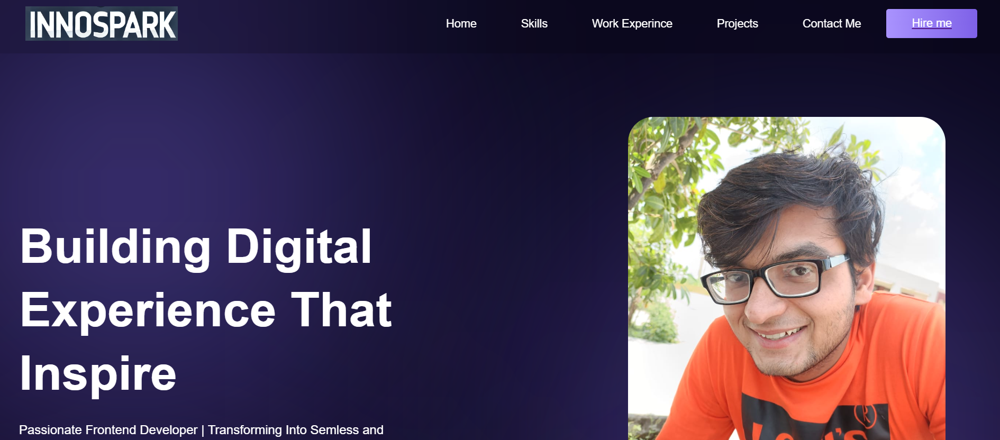

# Portfolio

Building Digital Experience That Inspire

## Technologies

- HTML
- CSS
- JavaScript
- React.js
- Node.js
- Vite
- JavascriptXML

## Objective :

A portfolio is a powerful tool to showcase your skills, projects, and professional identity, serving as a digital resume that highlights your expertise and creativity. It builds credibility, helps with networking, and provides a platform to demonstrate problem-solving abilities and a passion for learning. Through clear organization and an attractive design, a portfolio makes it easy for potential employers or clients to see what you offer and how to connect with you.

## Features

- Home Page with Professional Introduction
- Projects Showcase
- Contact Information & Social Links

## Screenshots




## Installation

1. Clone the repository:
   ```bash
   git clone https://github.com/64bitAtomic/Profolio
   ```
2. Navigate into the project directory:
   ```bash
   cd Pofolio
   ```
3. Install dependencies:
   ```bash
   npm install
   ```
4. Start the development server:
   ```bash
   npm start
   ```

## Usage

1. Open the website.
2. Enter a search term in the search bar.
3. Choose between Websites, News, Images, or Videos to see relevant results.

## Authors

- **Mohammad Zaid Khan**

## Contact

Feel free to reach out if you have any questions or suggestions!

- Email: zk286187@gmail.com
- GitHub: [64BitAtomic](https://github.com/64bitatomic)
